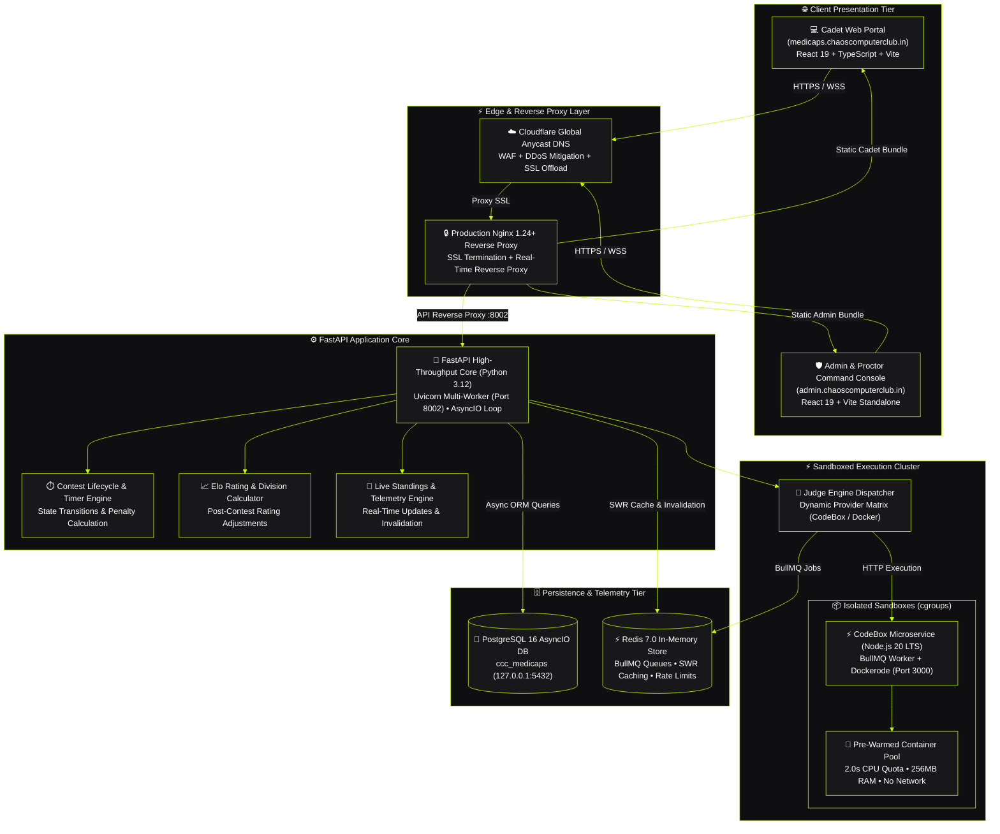
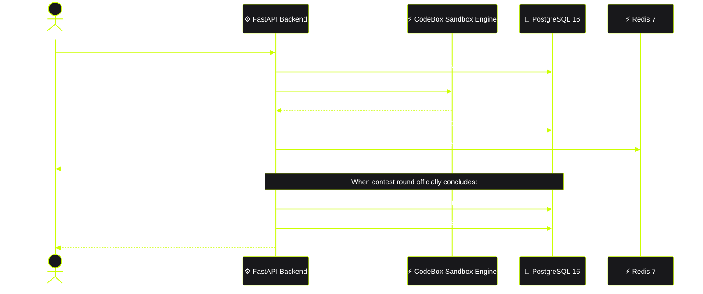

# Chaos Computer Club (CCC) — Medi-Caps University Chapter

[](https://medicaps.chaoscomputerclub.in)
[](https://medicaps.chaoscomputerclub.in)
[](https://medicaps.chaoscomputerclub.in/api/docs)
[](https://medicaps.chaoscomputerclub.in)
[](https://medicaps.chaoscomputerclub.in)
[](./LICENSE)

---

## 📌 Overview

The **CCC Medi-Caps Chapter Platform** is a full-stack, enterprise-grade competitive programming arena, member intelligence hub, and tournament execution platform engineered exclusively for the **Chaos Computer Club (CCC) Chapter at Medi-Caps University, Indore**.

Engineered for zero-friction access, low-latency live judging, and campus-wide competitive growth, the platform powers live university algorithmic tournaments (Weekly, Biweekly, and Special Invitationals) featuring direct Monaco IDE contest arenas, asynchronous sandboxed code execution via the **CodeBox Engine**, real-time ICPC/LeetCode-style standings, and a campus-wide 5-tier Star Elo rating ladder.

---

## 🚀 Key Features & Capabilities

```
┌─────────────────────────────────────────────────────────────────────────────┐
│                       CCC PLATFORM ARCHITECTURE MATRIX                      │
├──────────────────────┬──────────────────────┬───────────────────────────────┤
│ 🏆 Contest Arena     │ ⚡ Sandboxed Judge   │ 📊 Rating & Standings         │
│ • Direct Arena Entry │ • CodeBox Engine     │ • Official Points & Penalty   │
│ • Weekly / Biweekly  │ • Docker / cgroups   │ • 5-Tier Star Elo Ladder      │
│ • Monaco Code Studio │ • Sub-second Exec    │ • Live Podium Leaderboard     │
├──────────────────────┼──────────────────────┼───────────────────────────────┤
│ 🛡️ Integrity Layer   │ 🌐 Member Dossier    │ 🔄 Production Automation      │
│ • Blur/Tab Telemetry │ • LeetCode Sync      │ • Zero-Mock Architecture      │
│ • Rate Limiting      │ • CodeChef Sync      │ • GSD Continuous Sync         │
│ • Institutional Auth │ • GitHub Heatmaps    │ • Automated Health Probes     │
└──────────────────────┴──────────────────────┴───────────────────────────────┘
```

### 1. 🏆 Live Contest Arena & Tournament Lifecycle
- **Direct Tournament Access**: Every registered student with a valid university email (`@medicaps.ac.in`) competes directly in live rounds.
- **Full Contest Lifecycle**: Automated state management (`UPCOMING` → `REGISTRATION_OPEN` → `LOBBY` → `RUNNING` → `COMPLETED` → `ARCHIVED`).
- **Monaco Code Studio**: Rich, dark-mode competitive programming IDE supporting syntax highlighting, bracket matching, inline diagnostics, and custom input execution.
- **Sample vs Hidden Grading**: Instant feedback on sample testcases followed by full testcase grading upon formal submission.

### 2. ⚡ Sandboxed Code Execution Cluster (CodeBox Engine)
- **Multi-Language Support**: Secure execution for **C, C++, Python, JavaScript, TypeScript, and Java**.
- **Defense-in-Depth Isolation**: Linux kernel namespaces, cgroups, memory limits (256 MB), and CPU quotas (2.0s) with strict network disconnection (`--net=none`).
- **Resilient Fallback Matrix**:
  1. `CodeBox Engine` (High-throughput Node.js microservice with BullMQ queue)
  2. `Docker Container Pool` (Pre-warmed execution sandboxes)
  3. `Judge0 Cloud API` (External distributed fallback)
  4. `Local Isolated Subprocess` (Air-gapped development fallback)

### 3. 📈 Official Contest Standings & Elo Rating Ladder
- **LeetCode / ICPC Scoring Model**: Standings dynamically ranked by total solved problem points, with tie-breaking determined by submission elapsed time plus 5-minute penalties per incorrect attempt.
- **5-Tier Star Rating Ladder**:
  - `1★ Explorer` (< 1400)
  - `2★ Specialist` (1400 – 1599)
  - `3★ Knight` (1600 – 1799)
  - `4★ Master` (1800 – 1999)
  - `5★ Grandmaster` (2000+)
- **Live Podium View**: High-density podium display (🥇 Gold, 🥈 Silver, 🥉 Bronze) with department performance telemetry.

### 4. 🌐 Member Intelligence & External Profiles
- **Unified Coder Portfolio**: Automatically syncs and aggregates external competitive coding statistics from **LeetCode**, **CodeChef**, and **GitHub**.
- **Activity Heatmaps**: Monospace calendar heatmaps visualizing student consistency, contest attendance streaks, and problem-solving velocity.

---

## 🏗️ Architecture & System Topology



---

## 🔄 Contest Submission & Grading Flow



---

### Technology Matrix

| Layer | Technologies |
| :--- | :--- |
| **Frontend** | React 19, TypeScript 5.8, Vite 8, Tailwind CSS v4, Radix UI Primitives, Monaco Editor, Lucide Icons, Recharts, React Router v7 |
| **Backend API** | FastAPI, Python 3.12, Pydantic v2, SQLAlchemy 2.0 (AsyncIO), `asyncpg` / `aiosqlite`, Uvicorn |
| **Execution Engine** | `codebox-engine` (Node.js microservice), BullMQ, Docker Engine SDK, Linux cgroups, Isolate |
| **Persistence & Cache** | PostgreSQL 16 (Cloud Production), Redis 7.0 for BullMQ queues and SWR caching |
| **Security & Auth** | Passwordless institutional email verification (`@medicaps.ac.in` + OTP), JWT Bearer tokens, CORS regex |
| **Deployment** | Systemd, Nginx, GSD Deployment Protocol, DigitalOcean Cloud droplet (`143.198.38.205`) |

---

## 📁 Repository Structure

```
medicaps.chaoscomputerclub.in/
├── src/                               # ⚛️ Frontend Single Page Application (React 19)
│   ├── components/                    # Reusable UI component library (Radix primitives)
│   ├── features/                      # Domain features (contest client, lifecycle, queries)
│   ├── organization/                  # CCC Portal shell, header, status badges, telemetry
│   ├── pages/                         # Core pages (Arena, Contests Hub, Results, Standings)
│   ├── services/                      # Frontend API clients and backend communication layer
│   ├── types/                         # TypeScript domain models and API contracts
│   ├── AppRoutes.tsx                  # Client-side route declarations & route guards
│   └── main.tsx                       # React application bootstrap
│
├── admin/                             # 🛡️ Standalone Admin Command Console (Port 8082)
│   └── src/                           # Contest creation, proctoring, live ops
│
├── backend/                           # 🐍 High-Throughput REST API (FastAPI)
│   ├── app/
│   │   ├── api/v1/                    # Versioned API routes (/api/v1)
│   │   ├── core/                      # Configuration, async DB session, Redis connector
│   │   ├── engine/                    # Judge Engine abstraction layer
│   │   │   ├── docker/                # Prewarmed Docker container pools
│   │   │   └── providers/             # CodeBox, Docker, Interleet, Judge0, Local providers
│   │   ├── middleware/                # Security, rate limiting, and contest guards
│   │   ├── models/                    # SQLAlchemy async ORM models & database schemas
│   │   ├── routers/                   # Modular API controllers (auth, contests, leaderboard, etc.)
│   │   ├── schemas/                   # Pydantic validation schemas
│   │   └── services/                  # Business logic (Contest lifecycle, QA tests, Elo rating)
│   ├── keys/                          # Cryptographic token signing assets
│   ├── main.py                        # FastAPI entrypoint, lifespan manager & health probes
│   └── requirements.txt               # Backend dependencies
│
├── codebox-engine/                    # ⚡ Microservice Execution Sandbox (Node.js)
│   ├── src/
│   │   ├── api/                       # Fastify / Express submission ingestion endpoints
│   │   ├── executor/                  # Docker, Firecracker, Isolate sandbox executors
│   │   ├── languages/                 # Language compilers, flags, and memory constraints
│   │   └── queue/                     # BullMQ / Redis job queue consumers
│   ├── docker-compose.yml             # Sandbox container stack definitions
│   └── Caddyfile                      # Internal secure proxy configuration
│
├── scripts/                           # 🛠️ DevOps, verification & sync automation scripts
│   ├── gsd_sync.sh                    # Production GSD push-and-pull continuous deployment pipeline
│   └── gsd_qa_gate.sh                 # Full-stack automated verification test harness
├── TRD.md                             # Technical Requirements Document v3.0.0
├── PRD.md                             # Product Requirements Document v3.0.0
├── DESIGN.md                          # Visual standards & Obsidian UI aesthetic guidelines
├── AGENTS.md                          # Repository operating principles & deployment rules
└── package.json                       # Frontend dependencies and Vite build scripts
```

---

## 🚦 Quick Start & Local Development

### Prerequisites
- **Node.js**: `v20.x` or `v22.x` ([Download](https://nodejs.org/))
- **Python**: `3.11+` or `3.12` ([Download](https://www.python.org/))
- **Docker Engine**: (Optional, required for local sandboxed code execution)
- **PostgreSQL / SQLite**: SQLite enabled by default for local development; PostgreSQL 16 on production.

---

### Step 1: Clone the Repository
```bash
git clone https://github.com/ChaosComputerClub-India/medicaps.chaoscomputerclub.in.git
cd medicaps.chaoscomputerclub.in
```

---

### Step 2: Set Up & Run Backend

1. Navigate to the backend directory and activate the virtual environment:
```bash
cd backend
python3 -m venv .venv
source .venv/bin/activate
```

2. Install Python dependencies:
```bash
pip install --upgrade pip
pip install -r requirements.txt
```

3. Configure environment variables:
```bash
cp .env.example .env
```

4. Start the FastAPI development server:
```bash
uvicorn main:app --host 0.0.0.0 --port 8000 --reload
```
The API and interactive Swagger documentation will be available at:
- **API Endpoint**: `http://localhost:8000`
- **Interactive Swagger UI**: `http://localhost:8000/docs`
- **ReDoc UI**: `http://localhost:8000/redoc`

---

### Step 3: Set Up & Run Frontend

1. Open a new terminal in the project root and install Node dependencies:
```bash
npm install
```

2. Launch the Vite development server:
```bash
npm run dev
```
The frontend portal will be accessible at: `http://localhost:8081`

---

### Step 4: (Optional) Run Code Execution Engine

To run the local isolated code execution sandbox:
```bash
cd codebox-engine
npm install
npm run dev
```

---

## ⚙️ Environment Configuration

### Frontend (`.env`)

| Variable | Description | Default |
| :--- | :--- | :--- |
| `VITE_API_URL` | Base HTTP endpoint for the backend API | `http://localhost:8000/api` |

### Backend (`backend/.env`)

| Variable | Description | Default / Example |
| :--- | :--- | :--- |
| `PROJECT_NAME` | Name of the FastAPI application | `CCC Medi-Caps Arena API` |
| `HOST` | Server host binding | `0.0.0.0` |
| `PORT` | Server listening port | `8000` (8002 in prod) |
| `SECRET_KEY` | 32+ character key for JWT token signing | *(Secure random secret)* |
| `ACCESS_TOKEN_EXPIRE_MINUTES` | Lifetime of authentication sessions | `10080` (7 days) |
| `DATABASE_URL` | SQLAlchemy async connection URI | `sqlite+aiosqlite:///./ccc_medicaps.db` |
| `FRONTEND_URL` | Base URL of the client for CORS validation | `http://localhost:8081` |
| `JUDGE_PROVIDER` | Execution backend (`codebox`, `docker`, `local`, `judge0`) | `codebox` |
| `CODEBOX_URL` | Microservice URL for the CodeBox Engine | `http://127.0.0.1:3000` |
| `DEV_MODE` | Enables developer bypasses and rapid testing | `true` (local) / `false` (prod) |

---

## 🔌 API Endpoints Reference

### Core Endpoints

```
Authentication & Users
POST   /api/auth/register              # Register new student / member
POST   /api/auth/login                 # Obtain JWT access token via email OTP
GET    /api/auth/me                    # Current authenticated cadet profile

Contests & Arena
GET    /api/contests                   # List all active, upcoming & past contests
GET    /api/contests/{slug}            # Contest overview & metadata
GET    /api/contests/{slug}/problems   # Contest problem list
POST   /api/contests/{slug}/submit     # Submit solution for sandboxed grading
GET    /api/contests/{slug}/results    # Official contest standings (Rank, Score, Penalty)

Leaderboard & Ratings
GET    /api/leaderboard                # University rating ladder (supports ?department=, ?batch=, ?tier=)
GET    /api/leaderboard/departments    # Inter-department performance metrics
GET    /api/leaderboard/distribution   # Rating distribution histogram

System & Health
GET    /api/health                     # Production readiness probe & judge status
```

---

## 🚢 Production Deployment & GSD Sync Protocol

All production code updates follow the strict **GET SHIT DONE (GSD)** continuous sync pipeline:

```bash
./scripts/gsd_sync.sh "feat: describe your change here"
```

### What the Sync Pipeline Automates:
1. **Local Verification**: Executes `npm run build` locally to guarantee zero TypeScript or bundling defects.
2. **Atomic Git Push**: Pushes verified changes directly to `origin/main`.
3. **Server Auto-Pull**: Connects over SSH to the production server (`root@143.198.38.205`) and syncs repository state.
4. **Zero-Downtime Service Reload**:
   - Synchronizes backend code and restarts `ccc-medicaps-api.service`.
   - Rsyncs production frontend assets to `/var/www/ccc-medicaps/.output/public/`.
   - Reloads Nginx reverse proxy configurations.
5. **Live Verification Probes**: Pings production endpoints and asserts HTTP `200 OK` health status.

---

## 🛡️ Security & Sandbox Isolation Guarantees

- **Code Isolation**: All untrusted student code executes in unprivileged sandbox containers with strict seccomp profiles.
- **Resource Constraints**:
  - Max CPU Time: `2.0 seconds`
  - Max Memory: `256 MB`
  - Network: Fully air-gapped (`--net=none`)
  - File System: Read-only root with ephemeral `tmpfs` mounts
- **Anti-Cheat Telemetry**: Blur events, tab switches, and clipboard paste payloads are recorded and correlated with submission timestamps.

---

## 📜 License

This project is licensed under the **MIT License** — see the [LICENSE](./LICENSE) file for details.

---

<p align="center">
  <b>Chaos Computer Club — Medi-Caps University Chapter</b><br>
  <i>"All creatures welcome."</i>
</p>
