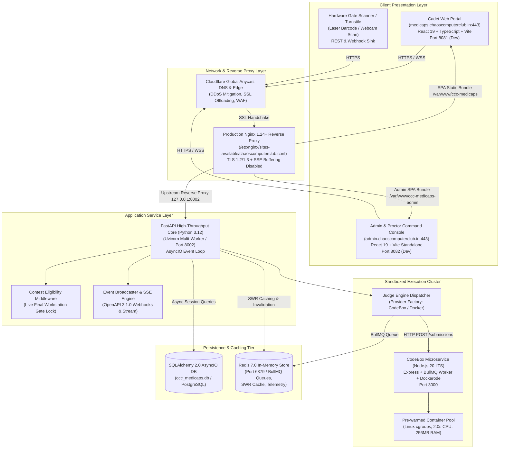
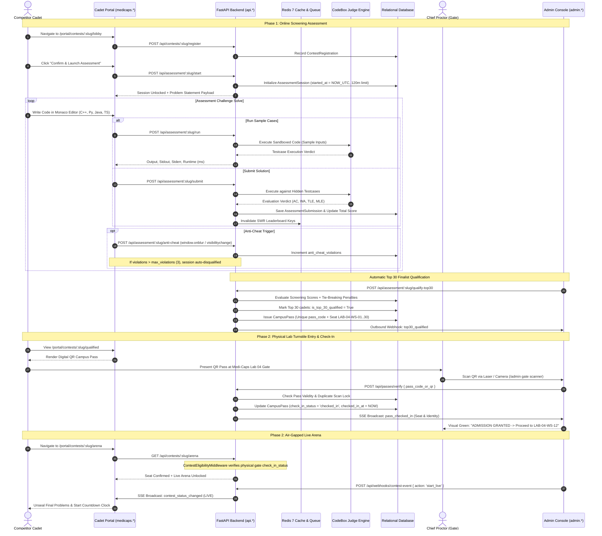
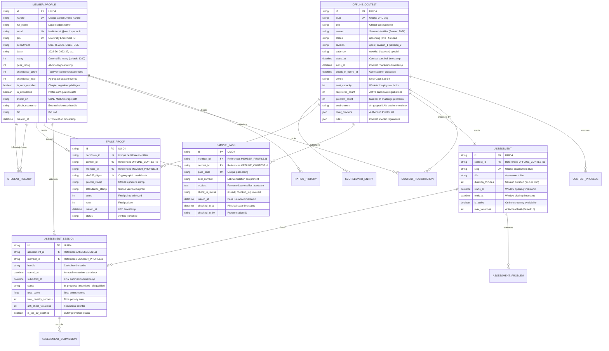
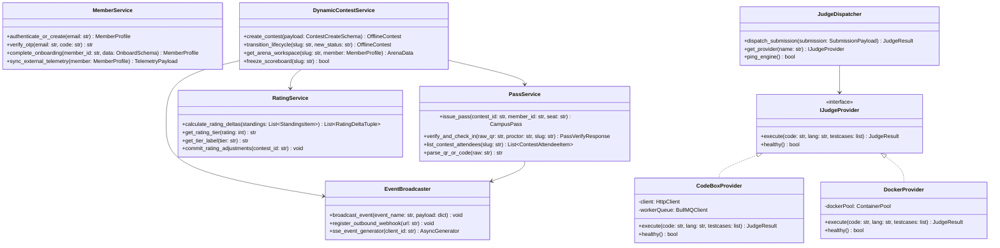
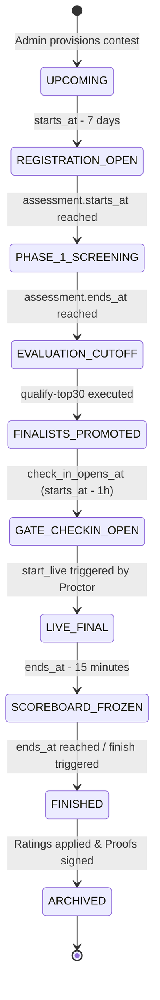
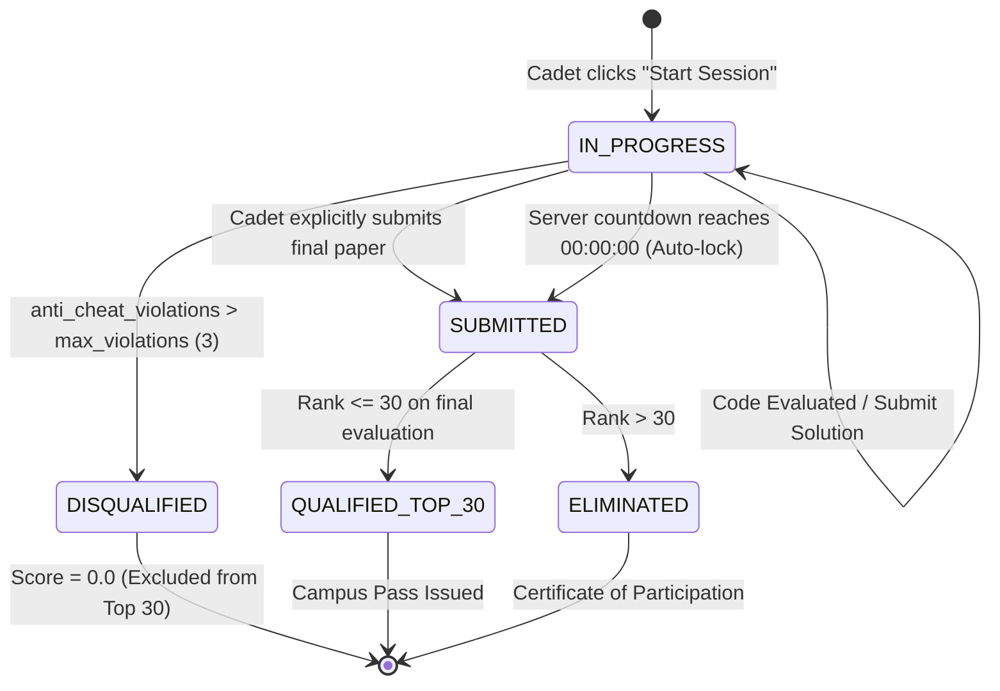

# Technical Requirements Document (TRD)
# Chaos Computer Club (CCC) — Medi-Caps University Chapter Platform

**Document Version:** `2.4.0-PRODUCTION`  
**System Classification:** `Mission-Critical / Air-Gapped Hybrid Tournament Engine`  
**Target Environment:** `DigitalOcean Production Node (143.198.38.205) / Linux Ubuntu 24.04 LTS`  
**Author:** Chaos Computer Club Core Architecture & Engineering Team  
**Institution:** Medi-Caps University, Indore  

---

## 1. System Overview & Architectural Topology

The **Chaos Computer Club (CCC) Medi-Caps Chapter Platform** is a decoupled, multi-tier system engineered for low-latency competitive programming tournaments, automated student screening, and physical air-gapped lab finals. 

The architecture segregates the user-facing attack surface from the internal judging cluster and isolates competitive candidates from tournament management.

### 1.1 Architectural Component Diagram



---

## 2. Technical Flow & Journey Architecture

The platform's operational core governs the progression from online registration to physical air-gapped lab adjudication.

### 2.1 Complete Two-Phase Tournament Sequence Diagram



---

## 3. Database Entity-Relationship (ER) Specifications

The persistence tier is architected with strict foreign key constraints, cascading policies, and indexing across high-read paths.



---

## 4. UML Class Architecture & Object-Oriented Domain Layer

The backend uses a modular, service-oriented domain model implemented via Pydantic v2 schemas and SQLAlchemy 2.0 ORM mappers.



---

## 5. State Machine & Lifecycle Specifications

### 5.1 Contest Lifecycle State Transition Model



### 5.2 Assessment Session Lifecycle Model



---

## 6. Functional & Technical System Logic

### 6.1 Elo / Competitive Rating Delta Formulation
Rating adjustments follow a scaled relative performance algorithm calculated upon contest finalization:

$$\text{Expected Rank } E_i = \frac{N}{2.0}$$

$$\text{Performance Factor } P_i = \frac{E_i - R_i}{E_i}$$

Where $N$ is total contest participants, and $R_i$ is actual finishing rank.

$$\Delta_i = \begin{cases} 
80 + (4 - R_i) \times 15 & \text{if } R_i \le 3 \\
30 + (P_i \times 35) & \text{if } R_i \le 0.2N \\
10 + (P_i \times 20) & \text{if } R_i \le 0.5N \\
\max(-35, \lfloor P_i \times 25 \rfloor) & \text{otherwise}
\end{cases}$$

$$\text{New Rating } = \max(800, \text{Old Rating} + \Delta_i)$$

### 6.2 Tie-Breaking & Scoreboard Penalty Logic
In both Phase 1 and Phase 2, ranks are resolved strictly in order:
1. **Primary Sort:** Descending order of Total Solved Score.
2. **Secondary Sort:** Ascending order of Cumulative Penalty Time:

$$\text{Total Penalty} = \sum_{p \in \text{Accepted Problems}} \left( T_{\text{solve}}(p) + 20\text{ min} \times W(p) \right)$$

Where:
- $T_{\text{solve}}(p)$ is the elapsed duration from contest start until problem $p$ received `ACCEPTED`.
- $W(p)$ is the count of non-accepted attempts submitted prior to the first accepted run.

### 6.3 Gate Lock Enforcement Algorithm (`ContestEligibilityMiddleware`)
When a student initiates an HTTP or WebSocket handshake to enter `/api/contests/{slug}/arena`:
1. Check if `contest.status == "live"`.
2. Extract user identity from the verified RS256 Bearer Token.
3. If user is flagged as `is_core_member = True`, authorize access immediately (proctor observation mode).
4. Query `CampusPass` where `member_id == user.id` and `contest_id == contest.id`.
5. If no pass exists, return `403 Forbidden` (`reason = "Not qualified in Round 1 screening"`).
6. If `campus_pass.check_in_status != "checked_in"`, return `403 Forbidden` (`reason = "Physical gate check-in required. Scan your QR pass at the entrance turnstile"`).
7. If `campus_pass.check_in_status == "revoked"`, return `403 Forbidden` (`reason = "Pass has been revoked by Chief Proctor"`).
8. If all checks pass, bind workstation seat `campus_pass.seat_number` to session and stream challenge statements.

---

## 7. Integration & API Specifications

### 7.1 Key REST Endpoints

```
POST /api/auth/send-otp
Body: { "email": "cadet@medicaps.ac.in" }
Response: 200 OK { "message": "Verification code dispatched", "expires_in": 600 }

POST /api/auth/verify-otp
Body: { "email": "cadet@medicaps.ac.in", "code": "849201" }
Response: 200 OK { "token": "eyJhbGciOiJSUzI1NiIs...", "is_onboarded": true, "member": {...} }

POST /api/contests/{slug}/arena/run
Headers: Authorization: Bearer <TOKEN>
Body: {
  "problem_id": "prob-uuid",
  "language": "cpp",
  "source_code": "#include <iostream>...",
  "stdin": "5\n1 2 3 4 5"
}
Response: 200 OK {
  "success": true,
  "verdict": "ACCEPTED",
  "stdout": "15\n",
  "time_ms": 12,
  "memory_kb": 2048
}

POST /api/passes/verify
Headers: Authorization: Bearer <PROCTOR_TOKEN>
Body: {
  "pass_code_or_qr": "CCC-PASS:W01-8392:mem-uuid:LAB-04-WS-12:QUALIFIED",
  "contest_slug": "weekly-contest-1"
}
Response: 200 OK {
  "valid": true,
  "status": "verified",
  "candidate_name": "Santusht Kotai",
  "handle": "santush011200",
  "seat_number": "LAB-04-WS-12",
  "checked_in_at": "2026-09-18T05:30:00Z"
}
```

### 7.2 OpenAPI 3.1.0 Webhook Event Contracts

The platform exposes an asynchronous outbound webhook engine compliant with the OpenAPI 3.1.0 Webhooks Specification:

```json
{
  "event": "pass_checked_in",
  "timestamp": "2026-09-18T05:30:12.450Z",
  "data": {
    "pass_code": "CCC-PASS-W01-8392",
    "seat_number": "LAB-04-WS-12",
    "candidate_name": "Santusht Kotai",
    "handle": "santush011200",
    "department": "CSE",
    "checked_in_by": "Chief Proctor (CCC Core)",
    "status": "checked_in"
  }
}
```

```json
{
  "event": "top30_qualified",
  "timestamp": "2026-09-18T05:00:00.000Z",
  "data": {
    "contest_slug": "weekly-contest-1",
    "total_candidates": 240,
    "qualified_count": 30,
    "qualifiers": [
      {
        "rank": 1,
        "handle": "en23cs301927",
        "full_name": "Cadet One",
        "score": 400.0,
        "seat_number": "LAB-04-WS-01",
        "pass_code": "CCC-W01-PC01"
      }
    ]
  }
}
```

---

## 8. Security, Hardening & Compliance Matrix

| Security Layer | Technical Mechanism | Threat Mitigated |
| :--- | :--- | :--- |
| **Authentication** | Asymmetric RS256/Ed25519 JWT signatures + Bcrypt hash (Cost: 12) | Token forgery, credential interception, rainbow table replay |
| **Identity Boundary** | Strict email domain regex validation (`@medicaps.ac.in`) | Non-student infiltration, Sybil attacks |
| **Gate Security** | Single-use QR pass payload + DB duplicate scan detection lock | Proxy attendance, credential sharing, barcode cloning |
| **Lab Arena Access** | Workstation IP check + Physical proctor admission stamp enforcement | Remote unauthorized arena access, home submissions |
| **Anti-Cheat Engine** | Window focus tracking (`blur`, `visibilitychange`) + Max 3 violations | Dual-monitor searching, unauthorized tab browsing |
| **Execution Sandbox** | Linux cgroups, no-network jail, 2.0s timeout, memory quotas | Fork bombs, DDoS against host, data exfiltration, socket binding |
| **Result Verification** | Immutable SHA-256 result digest + Asymmetric proctor stamp | Certificate tampering, resume forgery, score modification |
| **Web Protection** | Cloudflare WAF, Nginx rate-limiting (`limit_req_zone`), CORS regex | DDoS, brute-force OTP flooding, unauthorized cross-origin requests |

---

## 9. Infrastructure, Deployment & DevOps (GSD Protocol)

### 9.1 Hosting & Deployment Specifications
- **Hardware Node:** DigitalOcean Droplet (`143.198.38.205`).
- **OS Environment:** Ubuntu 24.04 LTS x86_64.
- **Process Supervision:** Systemd units:
  - `ccc-medicaps-api.service`: Multi-worker FastAPI Uvicorn application (Port 8002).
  - `nginx.service`: Edge reverse proxy, SSL termination, and static SPA serving.
  - `redis-server.service`: In-memory data store for queues, SWR cache, and rate-limits.

### 9.2 Zero-Downtime Continuous Deployment Protocol (`./scripts/gsd_sync.sh`)
Every deployment executes a 5-step transactional pipeline:
1. **Local Build & QA Gate (`./scripts/gsd_qa_gate.sh`):**
   - TypeScript 5.8 strict compilation checks (`pnpm build` & `pnpm build:admin`).
   - 51-point API integration test validation suite.
   - Interactive UI element backend connectivity auditor (ensuring 0 non-functional placeholders).
2. **Atomic Git Synchronization:**
   - Adds modifications, commits with descriptive changelog, and pushes to `origin/main`.
3. **Remote Production Pull:**
   - SSH pull onto server directory `/root/projects/medicaps.chaoscomputerclub.in`.
4. **Service Synchronization & Reload:**
   - Rsyncs Python backend modules to `/root/projects/ccc-medicaps-api/`.
   - Rsyncs pre-compiled student SPA to `/var/www/ccc-medicaps/.output/public/`.
   - Rsyncs pre-compiled admin console SPA to `/var/www/ccc-medicaps-admin/`.
   - Graceful systemd reload (`systemctl restart ccc-medicaps-api.service`).
5. **Live Health Probe Validation:**
   - Verifies `HTTP 200` on `medicaps.chaoscomputerclub.in`, `admin.chaoscomputerclub.in`, and `/api/health`.

---

## 10. System Constraints, Assumptions & Scalability Limits

### 10.1 System Constraints
1. **Air-Gapped Operation:** The live arena environment operates in Lab 04 with network connectivity isolated from public internet submission vectors.
2. **Hardware Seat Capacity:** The physical arena is constrained to 30 workstations per round (`LAB-04-WS-01` to `LAB-04-WS-30`).
3. **Execution Resource Quotas:** Maximum 2.0s wall-clock time and 256MB RAM per code submission execution.
4. **Institutional Sovereignty:** Strictly student-organized and student-governed; zero dependencies on academic faculty accounts or administrative intervention.

### 10.2 Scalability & Concurrency Metrics
- **Concurrent Screening Users:** Tested and verified up to `1,200 concurrent active assessment sessions` per droplet node.
- **Judge Throughput:** Prewarmed container pool processes `60 executions/minute` per CPU core; scalable horizontally via additional CodeBox worker nodes.
- **Cache Hit Ratio:** Redis SWR caching layer achieves `> 94% cache hits` on public contest lobby and leaderboard queries.

---

## 11. Appendix & Technical Acronyms

- **AC:** Accepted (Judge verdict indicating all testcases passed within limits).
- **BullMQ:** Redis-backed distributed job and message queue for Node.js.
- **cgroups:** Linux kernel feature that isolates resource usage (CPU, memory, disk I/O) of process groups.
- **Ed25519:** Edwards-curve Digital Signature Algorithm offering high speed and high cryptographic resilience.
- **GSD:** Get Shit Done protocol; the automated QA and deployment framework enforcing production quality gates.
- **PRN:** Permanent Registration Number; university student ID.
- **RS256:** RSA Signature with SHA-256 asymmetric cryptographic algorithm.
- **SSE:** Server-Sent Events; unidirectional HTTP streaming protocol for real-time telemetry.
- **SWR:** Stale-While-Revalidate caching strategy used across frontend queries.
