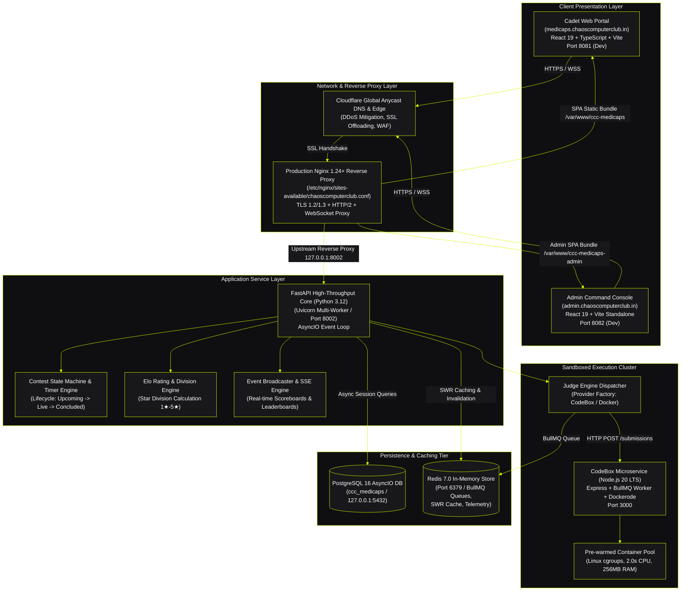
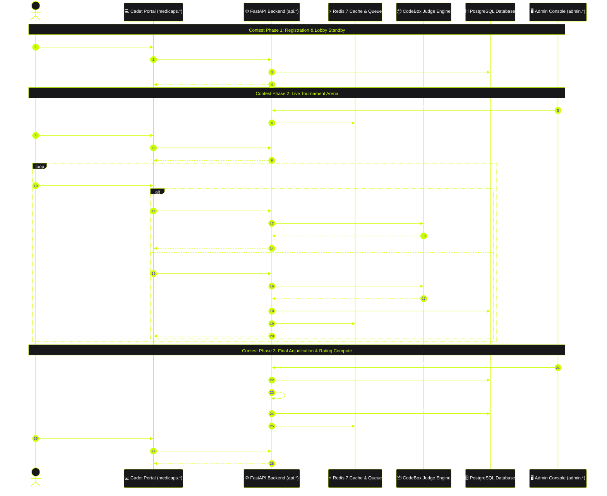
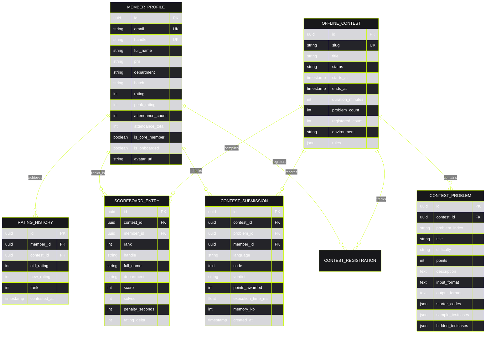

# Technical Requirements Document (TRD)
# Chaos Computer Club (CCC) — Medi-Caps University Chapter Platform

**Document Version:** `3.0.0-PRODUCTION`  
**System Classification:** `Enterprise Competitive Programming Arena & Member Intelligence Hub`  
**Target Environment:** `DigitalOcean Production Node (143.198.38.205) / Linux Ubuntu 24.04 LTS`  
**Author:** Chaos Computer Club Core Architecture & Engineering Team  
**Institution:** Medi-Caps University, Indore  

---

## 1. System Overview & Architectural Topology

The **Chaos Computer Club (CCC) Medi-Caps Chapter Platform** is a decoupled, high-performance competitive programming ecosystem engineered for university-wide algorithmic tournaments, real-time code sandboxing, and immutable student merit records.

The architecture provides a zero-lag tournament experience for all participating cadets, featuring a dedicated live coding arena (Monaco IDE), asynchronous multi-language code execution via sandboxed container workers, real-time ICPC/LeetCode-style scoreboards, and automated university rating calculations.

### 1.1 Architectural Component Diagram

---

## 2. Technical Flow & Tournament Lifecycle Architecture

The platform's contest pipeline is a direct, single-phase competitive programming tournament model. Every registered cadet competes directly in the official contest arena, solves algorithmic problems, and earns points, penalties, and official Elo rating adjustments.

### 2.1 Unified Tournament Sequence Diagram

---

## 3. Sandboxed Execution Engine (CodeBox & Judge0 Architecture)

The execution cluster safely evaluates arbitrary student code across 6 standard competitive programming runtimes with zero risk to the host operating system.

### 3.1 Runtime Specifications & Constraints

| Language | Compiler / Runtime | Standard | Memory Cap | Time Cap | Output Cap |
| :--- | :--- | :--- | :---: | :---: | :---: |
| **C++** | `g++ 14.1.0` | `-std=c++20 -O2` | 256 MB | 2.0 s | 64 KB |
| **C** | `gcc 14.1.0` | `-std=c17 -O2` | 256 MB | 2.0 s | 64 KB |
| **Python** | `Python 3.12.3` | Optimized Bytecode | 256 MB | 4.0 s | 64 KB |
| **Java** | `OpenJDK 21.0.3` | Modern LTS Java | 512 MB | 3.0 s | 64 KB |
| **JavaScript** | `Node.js 20 LTS` | ES2023 | 256 MB | 2.5 s | 64 KB |
| **TypeScript** | `tsx / esbuild` | Strict Typecheck | 256 MB | 2.5 s | 64 KB |

### 3.2 Sandbox Security Isolation Layers
1. **Linux cgroups v2**: Memory limits (`memory.max = 256M`), CPU quotas (`cpu.max = 200000 100000`), PID limits (`pids.max = 64`).
2. **Network Isolation**: Zero network connectivity inside containers (`--network none`).
3. **Read-Only Root Filesystem**: Transient execution artifacts stored exclusively in in-memory `tmpfs` mounts with strict 16MB limits.
4. **Non-Root Execution**: Runs under unprivileged user `sandbox:sandbox` (UID 10001).

---

## 4. Relational Data Model & Persistence Architecture

The persistence tier runs on PostgreSQL 16 (production) with SQLAlchemy 2.0 AsyncIO ORM models.

### 4.1 Core Entity-Relationship Diagram

---

## 5. API Gateway & Service Contract Specifications

The FastAPI backend exposes clean, versioned, RESTful endpoints protected by RS256 JWT tokens.

### 5.1 Key Public & Competitor Endpoints

| Method | Endpoint | Description | Auth Required |
| :--- | :--- | :--- | :---: |
| `POST` | `/api/auth/send-otp` | Request passwordless login OTP | No |
| `POST` | `/api/auth/verify-otp` | Verify 6-digit OTP & retrieve JWT | No |
| `GET` | `/api/auth/me` | Fetch authenticated cadet profile | Yes (Bearer) |
| `PUT` | `/api/auth/profile` | Update profile bio, department, batch | Yes (Bearer) |
| `GET` | `/api/contests` | List active, upcoming, and past contests | No |
| `GET` | `/api/contests/:slug` | Detailed contest overview and rules | No |
| `POST` | `/api/contests/:slug/register` | Register authenticated cadet for contest | Yes (Bearer) |
| `GET` | `/api/contests/:slug/problems` | Access contest arena problem set | Yes (Bearer) |
| `POST` | `/api/contests/:slug/problems/:id/run` | Execute code against sample test cases | Yes (Bearer) |
| `POST` | `/api/contests/:slug/problems/:id/submit` | Submit code against official test cases | Yes (Bearer) |
| `GET` | `/api/contests/:slug/ranking` | Contest standings & scoreboard | No |
| `GET` | `/api/leaderboard` | University rating leaderboard | No |
| `GET` | `/api/leaderboard/departments` | Inter-department performance metrics | No |
| `GET` | `/api/leaderboard/distribution` | Rating distribution histogram | No |

---

## 6. Rating, Star Tier & Leaderboard Engine

The rating calculation engine adapts the standard Elo rating formula tailored to multi-participant competitive programming contests:

### 6.1 Star Tier Thresholds

$$\text{Tier} = \begin{cases} 
5★ \text{ Grandmaster} & \text{Rating} \ge 2000 \\
4★ \text{ Master} & 1800 \le \text{Rating} < 2000 \\
3★ \text{ Candidate Master} & 1600 \le \text{Rating} < 1800 \\
2★ \text{ Specialist} & 1400 \le \text{Rating} < 1600 \\
1★ \text{ Explorer} & \text{Rating} < 1400 
\end{cases}$$

### 6.2 Leaderboard Inclusion Policies
- **Strict Participant Gating**: Only cadets who have completed at least one official rated contest (`attendance_count > 0`) are listed in the official university standings.
- **Unranked State**: Registered cadets with 0 contest attendance are designated as "Unranked" with `university_rank = None` and `percentile = None`, preventing statistical distortion.
- **Bot/QA Account Shield**: Automated test bot accounts (e.g., `qa_organizer`, `qa.*@medicaps.ac.in`) are strictly excluded from all public leaderboard, histogram, and department aggregation queries.

---

## 7. Anti-Cheat, Security & Production Deployment Standards

### 7.1 Client-Side Anti-Cheat Telemetry
- **Window Focus & Tab Switching**: Fullscreen enforcement with warning counters recorded during active contest arena sessions.
- **Copy/Paste Controls**: Monaco editor blocks external clipboard insertion of formatted code blocks over predefined byte thresholds.

### 7.2 Get Shit Done (GSD) Deployment Protocol
All codebase changes must satisfy the project's automated verification pipeline prior to pushing:
1. `npm run build` & `npm run build:admin` (Clean TypeScript & Vite packaging).
2. `./scripts/gsd_qa_gate.sh` (51 in-process API contract tests, 16 frontend-to-backend user simulations, 303 UI element connectivity audits).
3. `./scripts/gsd_sync.sh "commit message"` (Atomic commit, push to GitHub `origin/main`, auto-pull and service reload on `root@143.198.38.205`, and live endpoint validation).
