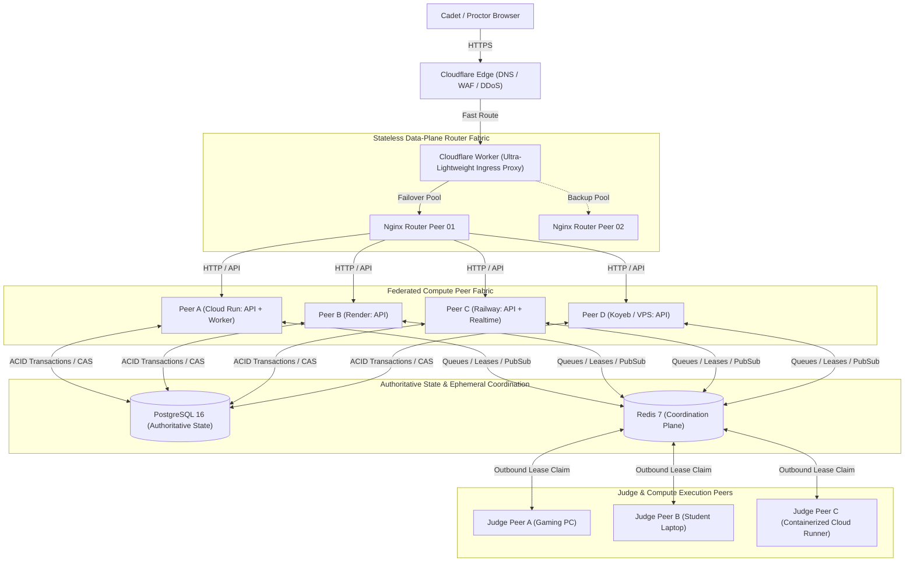
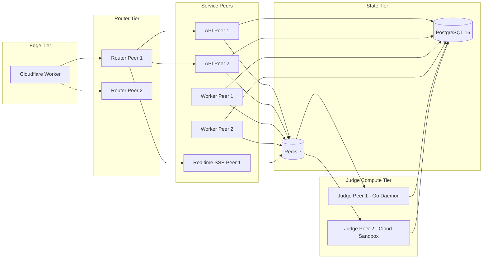
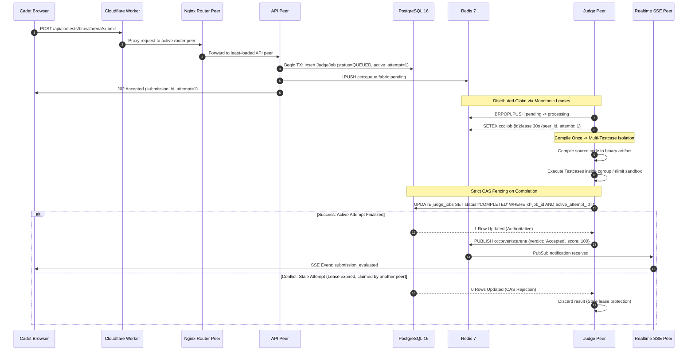
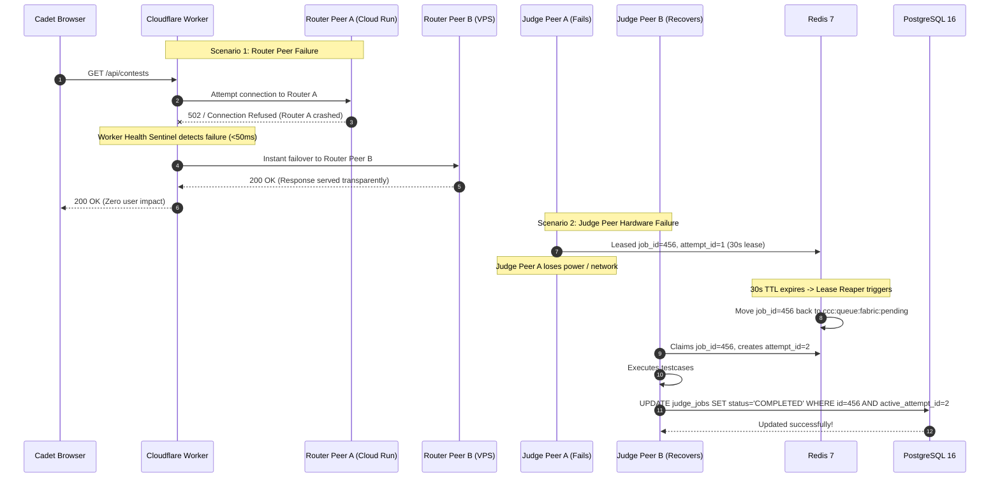

# CCC Peer-to-Peer Distributed Service Fabric
## Architectural Specification & Master Contract

---

### 1. The Core Architectural Thesis

> **Every compute instance is a peer. Providers are merely locations where peers happen to run.**  
> There is **NO single control plane**, **NO single application server**, **NO provider required for normal operation**, and **NO centralized service discovery server required for basic operation.**  
> There is **one authoritative business data model** (PostgreSQL 16) and **shared ephemeral coordination** (Redis 7), but compute is fully federated.

Providers (Google Cloud Run, Render, Railway, Fly.io, Koyeb, Northflank, VPS, student laptops, gaming rigs) can be **added or removed dynamically without changing the application's logical architecture, database schemas, or frontend interfaces.**

---

### 2. Level 1 Architecture: Ingress, Data Plane & Federated Peers

---

### 3. Level 2 Architecture: Subsystem Responsibilities

---

### 4. Level 3 Architecture: Submission Lifecycle & CAS Fencing

---

### 5. Level 3 Architecture: Provider & Judge Failure Resiliency

---

### 6. Summary of Architectural Invariants

| Dimension | Immutable Contract |
|---|---|
| **Control Plane** | **None.** Compute is peer-to-peer. Every service is a self-governing peer. |
| **Ingress Edge** | Cloudflare Edge + ultra-lightweight Worker (<10ms CPU) routing to stateless Nginx router fabric. |
| **Data Plane** | Horizontally replicated, disposable Nginx router peers with dynamic upstream reload. |
| **Authoritative State** | Managed PostgreSQL 16 with ACID transactions, idempotency keys, and CAS fences. |
| **Shared Coordination** | Redis 7 for ephemeral queues, distributed leases, heartbeats, and SSE pub/sub. |
| **Compute Scalability** | Compile-once, isolated testcase execution across heterogeneous compute peers. |
