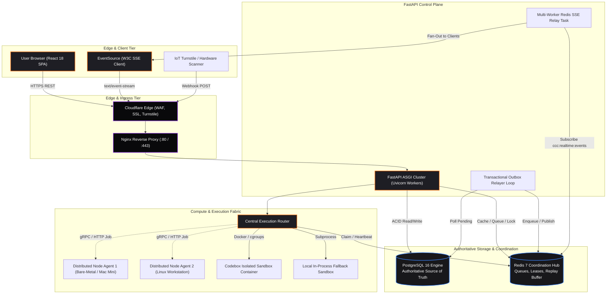
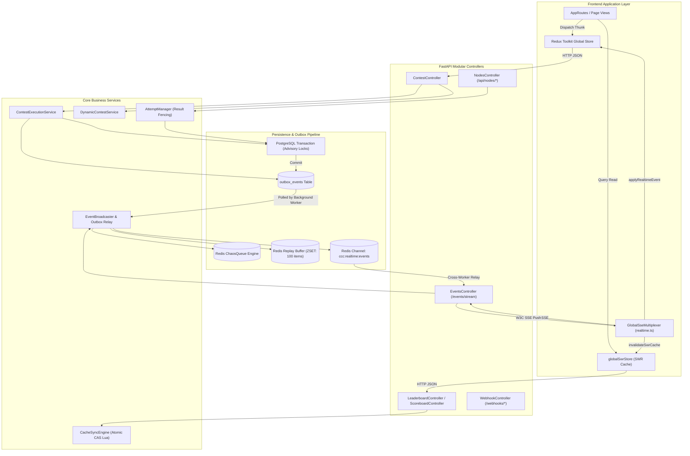
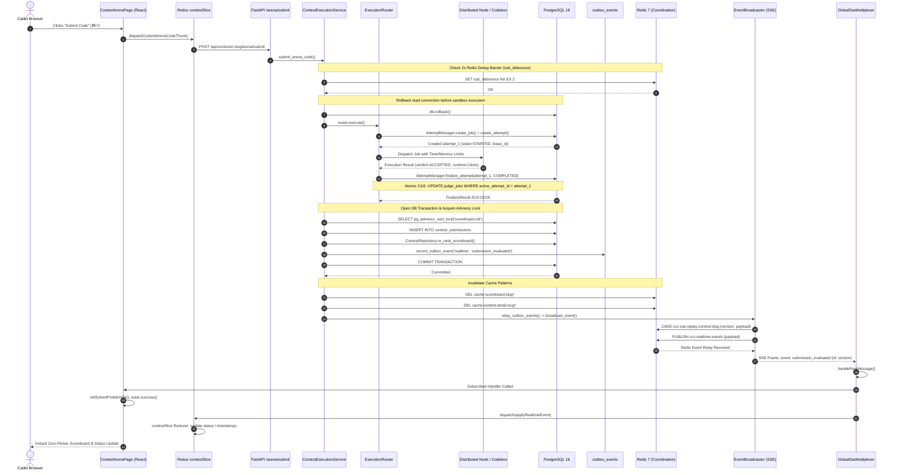

# THREE-LEVEL END-TO-END ARCHITECTURE SPECIFICATION
**Platform:** Chaos Computer Club (CCC) — Medi-Caps Chapter  
**Scope:** Macro System, Microservice/Data Flow, and Deep Execution/State Engine  
**Status:** PRODUCTION AS-BUILT FORENSIC SPECIFICATION  

---

## 1. Architectural Narrative & System Levels

The Chaos Computer Club architecture is structured across three complementary levels of detail:

1. **Level 1 (System / Macro Architecture)**: Depicts the physical infrastructure, network ingress boundaries, core persistence layers, and compute nodes.
2. **Level 2 (Service / Data Flow Architecture)**: Traces application service boundaries, caching layers, transactional outbox relays, and the execution router fabric.
3. **Level 3 (Event / State / Execution Architecture)**: Traces the precise millisecond-level causal progression of mutations from User Action $\to$ PostgreSQL Row Locks $\to$ Transactional Outbox $\to$ Redis Pub/Sub $\to$ SSE $\to$ Redux $\to$ React DOM, including attempt leasing and conditional CAS fences.

---

## 2. Level 1 — Macro Architecture Diagram

---

## 3. Level 2 — Service & Data Flow Architecture Diagram

---

## 4. Level 3 — Event, State & Submission Execution Architecture Diagram

