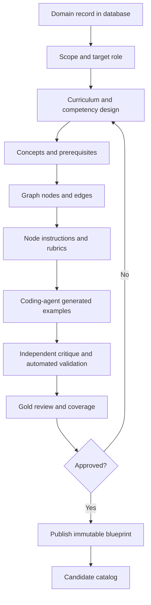
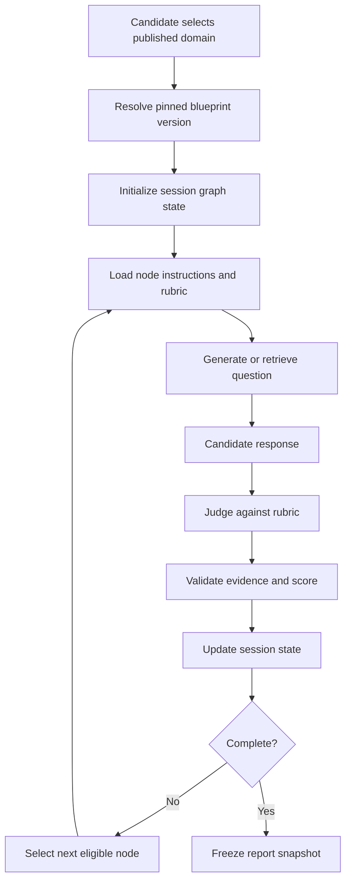
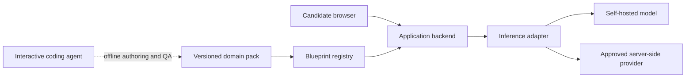
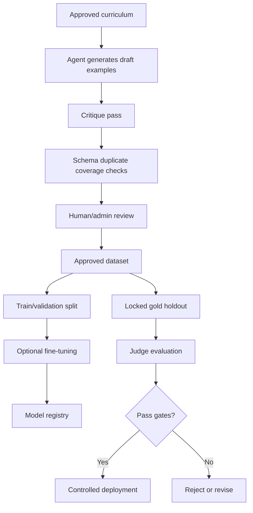

# Domain Training and Runtime

## Offline domain preparation

```mermaid
flowchart TD
 A[Domain record in database] --> B[Scope and target role]
 B --> C[Curriculum and competency design]
 C --> D[Concepts and prerequisites]
 D --> E[Graph nodes and edges]
 E --> F[Node instructions and rubrics]
 F --> G[Coding-agent generated examples]
 G --> H[Independent critique and automated validation]
 H --> I[Gold review and coverage]
 I --> J{Approved?}
 J -->|No| C
 J -->|Yes| K[Publish immutable blueprint]
 K --> L[Candidate catalog]
```

## Runtime

```mermaid
flowchart TD
 A[Candidate selects published domain] --> B[Resolve pinned blueprint version]
 B --> C[Initialize session graph state]
 C --> D[Load node instructions and rubric]
 D --> E[Generate or retrieve question]
 E --> F[Candidate response]
 F --> G[Judge against rubric]
 G --> H[Validate evidence and score]
 H --> I[Update session state]
 I --> J{Complete?}
 J -->|No| K[Select next eligible node]
 K --> D
 J -->|Yes| L[Freeze report snapshot]
```

## Inference boundary

```mermaid
flowchart LR
 UI[Candidate browser] --> APP[Application backend]
 APP --> ADAPTER[Inference adapter]
 ADAPTER --> LOCAL[Self-hosted model]
 ADAPTER --> HOSTED[Approved server-side provider]
 DEV[Interactive coding agent] -. offline authoring and QA .-> PACK[Versioned domain pack]
 PACK --> REG[Blueprint registry]
 REG --> APP
```

## Dataset governance

```mermaid
flowchart TD
 A[Approved curriculum] --> B[Agent generates draft examples]
 B --> C[Critique pass]
 C --> D[Schema duplicate coverage checks]
 D --> E[Human/admin review]
 E --> F[Approved dataset]
 F --> G[Train/validation split]
 F --> H[Locked gold holdout]
 G --> I[Optional fine-tuning]
 H --> J[Judge evaluation]
 I --> K[Model registry]
 J --> L{Pass gates?}
 L -->|Yes| M[Controlled deployment]
 L -->|No| N[Reject or revise]
```
