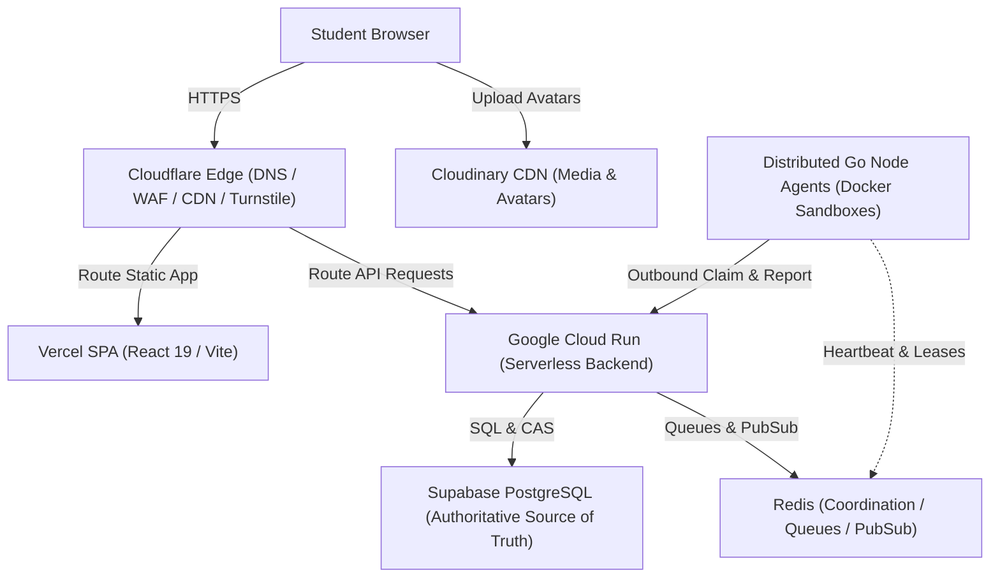
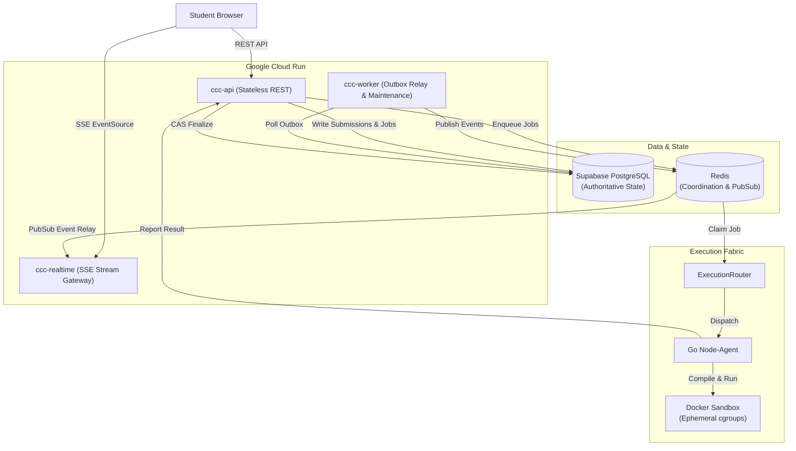
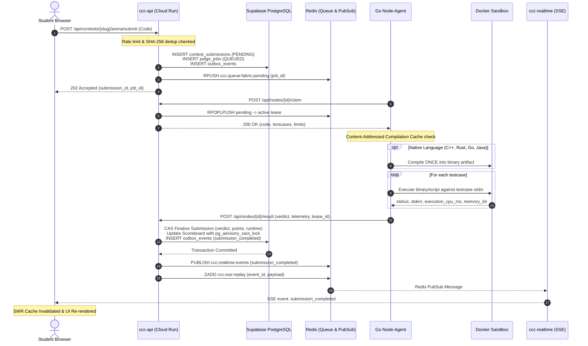

# CCC Medi-Caps — Target Distributed Cloud Infrastructure Architecture

> **Architecture Status**: Distributed Free-Tier-First Production Architecture  
> **Authoritative State Model**: PostgreSQL (Supabase) as Authoritative Truth; Redis as Coordination & State Acceleration; Cloud Run for Stateless Backend; Vercel for Edge Frontend; Cloudflare for Edge Security & DNS; Cloudinary for Media CDN; Distributed Go Nodes for Isolated Sandboxed Execution.

---

## 1. Architectural Vision & Principles

The redesign shifts the platform from a resource-constrained 4 GB single VPS into a horizontally decoupled, multi-provider, free-tier-first ecosystem:
1. **Authoritative Truth Isolation**: Only PostgreSQL (Supabase) stores business truth. Redis, Cloud Run instance memory, local caches, and frontend stores are ephemeral and disposable.
2. **Workload Decoupling**: API serving, asynchronous queue processing, and real-time SSE event fanout are split into independent, disposable services.
3. **Execution Sandbox Boundary**: Untrusted contestant code **never** runs unsandboxed on Google Cloud Run. Untrusted code executes strictly on distributed Go judge nodes with ephemeral Docker cgroups/namespaces, or on validated isolated execution runtimes.
4. **Resilience Through Disposability**: Any container, worker, or edge instance can terminate instantly without corrupting transactional database state.

---

## 2. Logical Architecture Overview

```
                         INTERNET
                            │
                            ▼
                  ┌────────────────────┐
                  │    CLOUDFLARE      │
                  │ DNS / WAF / CDN    │
                  │ Edge SSL / Routing │
                  └─────────┬──────────┘
                            │
             ┌──────────────┴──────────────┐
             │                             │
             ▼                             ▼
      ┌─────────────┐              ┌───────────────┐
      │   VERCEL    │              │  CLOUDFLARE   │
      │ React / Vite│              │  WORKERS      │
      │ Frontend SPA│              │ Edge Gateway  │
      └──────┬──────┘              └───────┬───────┘
             │                             │
             │                             ▼
             │                    ┌──────────────────┐
             │                    │ GOOGLE CLOUD RUN │
             │                    │ (Stateless APIs) │
             │                    └────────┬─────────┘
             │                             │
             │                 ┌───────────┼───────────┐
             │                 ▼           ▼           ▼
             │              ccc-api    ccc-worker  ccc-realtime
             │                 │           │           │
             └─────────────────┴─────┬─────┴───────────┘
                                     │
                        ┌────────────┴────────────┐
                        ▼                         ▼
                 ┌──────────────┐          ┌──────────────┐
                 │   SUPABASE   │          │    REDIS     │
                 │  PostgreSQL  │          │ Coordination │
                 │ AUTHORITATIVE│          │  Ephemeral   │
                 └──────────────┘          └──────┬───────┘
                                                  │
                                                  ▼
                                       ┌────────────────────┐
                                       │  EXECUTION ROUTER  │
                                       └──────────┬─────────┘
                                                  │
                                   ┌──────────────┴──────────────┐
                                   ▼                             ▼
                            Distributed Go Nodes           Google Cloud
                            (Personal Compute / VPS)       Validated Sandbox
                                   │                             │
                                   ▼                             ▼
                             Docker Sandbox                Isolated Container
                                   │                             │
                                   └──────────────┬──────────────┘
                                                  ▼
                                             Judge Result
                                                  │
                                                  ▼
                                            PostgreSQL CAS
                                                  │
                                                  ▼
                                            Outbox Event
                                                  │
                                                  ▼
                                            Redis Pub/Sub
                                                  │
                                                  ▼
                                            Realtime SSE
                                                  │
                                                  ▼
                                              Browser
```

---

## 3. Provider Responsibilities & Invariants

### 3.1 Cloudflare (DNS, WAF, Edge Gateway)
- **Apex DNS & Routing**: Resolves `medicaps.chaoscomputerclub.in` (Vercel CNAME) and `medicaps-api.chaoscomputerclub.in` (Cloud Run custom domain or Cloudflare Worker reverse proxy).
- **Security & Shielding**: Cloudflare Turnstile token validation, DDoS attack mitigation, HTTP/3, TLS 1.3, strict security headers (HSTS, CSP, COOP, X-Content-Type-Options).
- **Edge Worker**: Request normalization, rate limiting, and CORS edge shielding.
- **Invariants**: No database transactions, no heavy compilation, no state persistence in Workers.

### 3.2 Vercel (Frontend Hosting)
- **Deployment**: Immutable, atomic builds of the React/Vite Single Page Application.
- **Routing**: `vercel.json` SPA fallbacks (`/(.*) -> /index.html`), cache-control headers (`assets/` cached immutable for 1 year; `index.html` `no-cache, must-revalidate`).
- **Environment**: Build-time injection of `VITE_API_URL` and `VITE_CLOUDFLARE_TURNSTILE_SITE_KEY`.
- **Invariants**: Zero server secrets in client bundles; zero full-page reload waterfalls.

### 3.3 Google Cloud Run (Compute Engine)
- **Container Topology**:
  1. `ccc-api`: Stateless FastAPI application serving REST endpoints (Auth, Contests, Problems, Submissions, Leaderboards).
  2. `ccc-worker`: Idempotent background worker processing transactional outbox events, queue jobs, and contest lifecycle transitions.
  3. `ccc-realtime`: Lightweight ASGI streaming service dedicated to Server-Sent Events (SSE), subscribing to Redis Pub/Sub and serving `Last-Event-ID` replays.
- **Scaling Guardrails**: Conservative autoscaling (Min instances: `0`, Max instances: `3` to `5`) to prevent connection storms on Supabase.
- **Invariants**: Zero authoritative state in container RAM or local disk. Disposable instances.

### 3.4 Supabase (Authoritative PostgreSQL 16)
- **Role**: Sole authoritative source of truth for identities, contest state, problem specifications, submissions, ratings, and outbox events.
- **Connection Management**:
  - Direct connection (port `5432`): Used for schema migrations and administrative operations.
  - Supavisor Transaction Pooler (port `6543`): Used by Cloud Run services with bounded connection pools (`pool_size=3`, `max_overflow=2` per container instance).
- **Concurrency & CAS**: Optimistic concurrency control via monotonic `version` columns; `pg_advisory_xact_lock` on scoreboard updates; transactional outbox pattern.

### 3.5 Redis (Distributed Coordination & Acceleration)
- **Role**: Ephemeral queueing, distributed locking, SingleFlight acceleration, real-time Pub/Sub fanout, and circular SSE replay buffers.
- **Namespaces**:
  - `ccc:queue:*` — Distributed job queues
  - `ccc:lease:*` — Active worker attempt leases
  - `ccc:node:*` — Worker heartbeats & hardware registries
  - `ccc:realtime:events` — Cross-service Pub/Sub channel
  - `ccc:sse:replay:*` — Circular replay ZSET for reconnecting clients
  - `ccc:cache:*` — Read-through caches
  - `ccc:dedup:*` — Submission SHA-256 deduplication locks
- **Invariants**: Losing Redis must never lose user code, scoreboard points, or contest results.

### 3.6 Cloudinary (Media Asset CDN)
- **Role**: User avatars, contest banners, and editorial illustrations.
- **Upload Flow**: Direct signed uploads from client to Cloudinary, or authenticated signed backend uploads. Database stores strictly public IDs and secure URLs.
- **Invariants**: No media stored on VPS disk or Cloud Run container filesystem.

### 3.7 Distributed Go Node Agents (Compute Workers)
- **Role**: Dedicated, isolated, sandboxed execution of untrusted user code.
- **Model**: Disposable compute running on developer laptops, personal workstations, or dedicated lab machines.
- **Communication**: Outbound HTTPS/TLS only. Nodes poll `POST /api/nodes/{id}/claim` and post results to `POST /api/nodes/{id}/result`. Zero inbound public open ports.
- **Toolchains**: Single-compile-per-submission model for C/C++/Java/Rust/Go. Docker container sandboxes with memory, CPU, PID, and non-root execution limits.

---

## 4. Mermaid Level 1: Global System Topology



---

## 5. Mermaid Level 2: Service & Data Flow Topology



---

## 6. Mermaid Level 3: Submission Execution Lifecycle & Authority Chain


